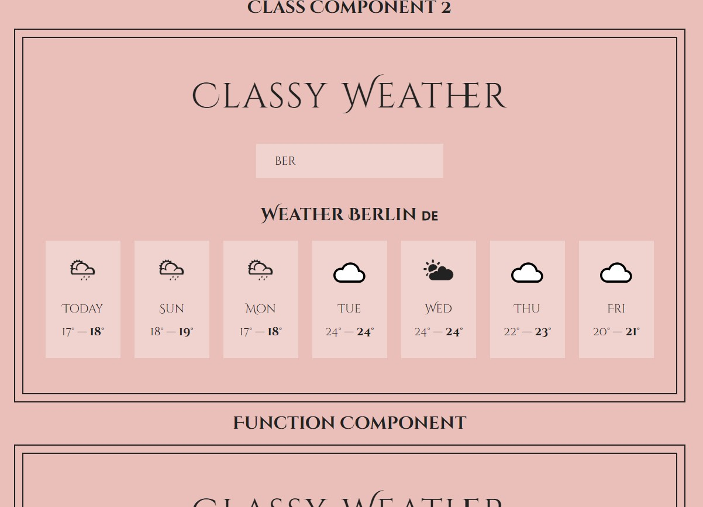

# Classy Weather

## Table of contents

- [Overview](#overview)
  - [The challenge](#the-challenge)
  - [Screenshot](#screenshot)
  - [Links](#links)
- [My process](#my-process)
  - [Built with](#built-with)
  - [What I learned](#what-i-learned)
  - [Continued development](#continued-development)
  - [Useful resources](#useful-resources)
- [Author](#author)

## Overview

### The challenge

Users should be able to:

- View the optimal layout for the app depending on their device's screen size.(Working on it)
- Type name of the city,town or village in the input
- See result of the forcast for the next 7 days

### Screenshot

### Links

- Live Site URL: [View](https://classweather24.netlify.app/)

## My process

Certainly! Here's an elaboration on the process of transitioning from class components to function components in React, considering the steps you've outlined:

1. **Our First Class Component:** Begin by creating a basic class component to manage state and lifecycle methods. This foundational step involves setting up a component with state, rendering UI elements, and using class-based methods for interaction and updates.

2. **Working With Event Handlers:** Implement event handlers in your class component to manage user interactions. This step involves defining methods to handle events such as button clicks or form submissions and binding these methods to the component’s context.

3. **Fetching Weather Data:** Add functionality to fetch weather data from an API within your class component. Utilize lifecycle methods like `componentDidMount` to perform asynchronous operations and update the component state based on the fetched data.

4. **Displaying the Weather:** Once weather data is fetched, render it in the UI. This involves updating the component’s state with the fetched data and ensuring the UI displays the weather information correctly.

5. **Removing Boilerplate Code With Class Fields:** Simplify your class component by using class fields to eliminate boilerplate code. Class fields allow for a cleaner syntax, particularly for defining methods and initializing state without needing constructor methods.

6. **Child to Parent Communication:** Implement communication between child and parent components. In class components, this typically involves passing down callback functions as props from the parent to the child and invoking these functions to send data or trigger updates.

7. **Lifecycle Methods:** Understand and utilize lifecycle methods like `componentDidUpdate`, `componentDidMount`, and `componentWillUnmount` to manage component behavior at different stages of its lifecycle. These methods are crucial for handling side effects and cleaning up resources.

8. **Convert Class to Function Components:** Finally, transition your class components to function components using React hooks. Replace lifecycle methods with `useEffect`, manage state with `useState`, and handle events directly in functional components. This modern approach simplifies code, reduces boilerplate, and aligns with current best practices in React development.

By following these steps, you’ll transition from a class-based approach to a more modern and concise functional component style, leveraging hooks for state management and side effects.

### Built with

- Semantic HTML5 markup
- CSS custom properties
- Flexbox
- Mobile-first workflow
- Mobile-Responsive Design
- JavaScript - Scripting language
- [React](https://reactjs.org/) - JS library
- [Next.js](https://nextjs.org/) - React framework

### What I learned

Learned the old way of class components.

### Continued development

### Useful resources

- [Example resource 1](https://www.example.com) - This helped me for XYZ reason. I really liked this pattern and will use it going forward.
- [Example resource 2](https://www.example.com) - This is an amazing article which helped me finally understand XYZ. I'd recommend it to anyone still learning this concept.

**Note: Delete this note and replace the list above with resources that helped you during the challenge. These could come in handy for anyone viewing your solution or for yourself when you look back on this project in the future.**

## Author

- Website - [Cameron Howze](https://camkol.github.io/)
- Frontend Mentor - [@camkol](https://www.frontendmentor.io/profile/camkol)
- GitHub- [@camkol](https://github.com/camkol)
- LinkedIn - [@cameron-howze](https://www.linkedin.com/in/cameron-howze-28a646109/)
- E-Mail - [cameronhowze4@outlook.com](mailto:cameronhowze4@outlook.com)
